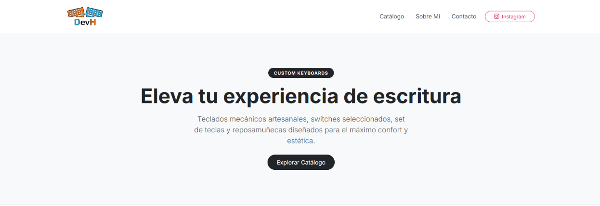
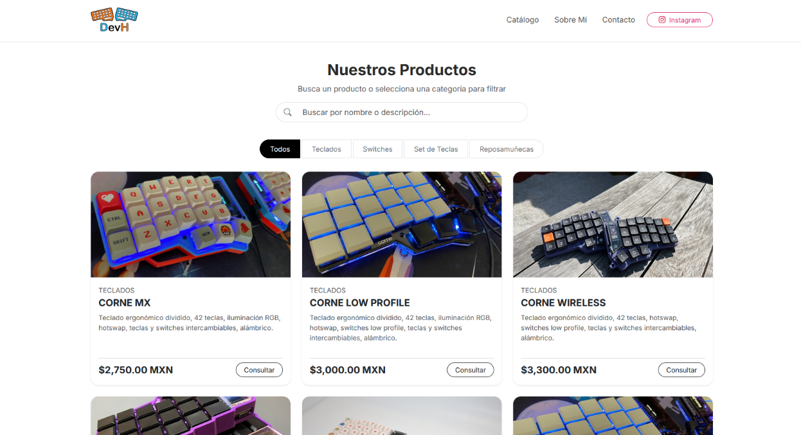
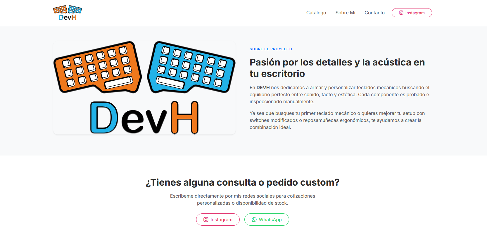

# DEVH Web

Official DEVH website, designed to showcase its services, products, and solutions in a modern and professional manner.

## Overview

DEVH Web is a modern product showcase website inspired by custom mechanical keyboard stores and communities.

The website allows products to be managed dynamically through a simple JSON file, making it easy to add or update products without modifying the HTML structure.

## Features

* Modern and responsive design
* Dynamic product catalog
* Product categories
* Product descriptions and pricing
* Product images
* Project showcase
* Easy product management through JSON

## How It Works

Products are registered in `productos.json`, including their category, title, description, price, and image path.

Example:

```json
{
  "id": 2,
  "categoria": "teclados",
  "titulo": "CORNE LOW PROFILE",
  "descripcion": "Teclado ergonómico dividido, 42 teclas, iluminación RGB, hotswap, switches low profile, teclas y switches intercambiables, alámbrico.",
  "precio": "$3,000.00 MXN",
  "imagenes": [
    "images/teclados/cornelowprofile.jpg"
  ]
}
```

The `main.js` file loads the product data from `productos.json` and dynamically renders it on `index.html`.

## Project Structure

```text
devh-web/
│
├── index.html
├── main.js
├── style.css
├── productos.json
│
└── images/
    ├── logo.png
    ├── reposamunecas/
    ├── setteclas/
    ├── switches/
    ├── teclados/
    └── project/
```

The `images/project/` directory contains images related to the DEVH project and website showcase.

## Tech Stack

* HTML5
* CSS3
* JavaScript
* JSON

## Project Showcase





---

**DEVH Web** — Custom keyboards, components, and solutions.
